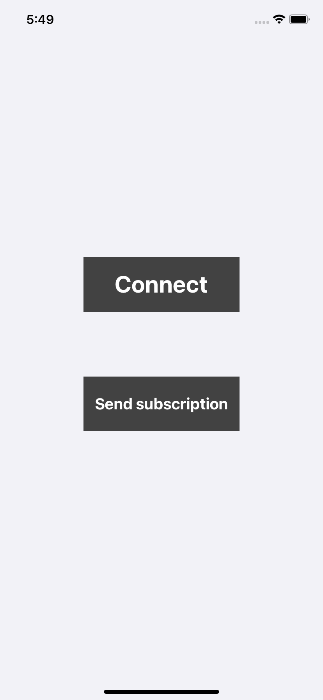
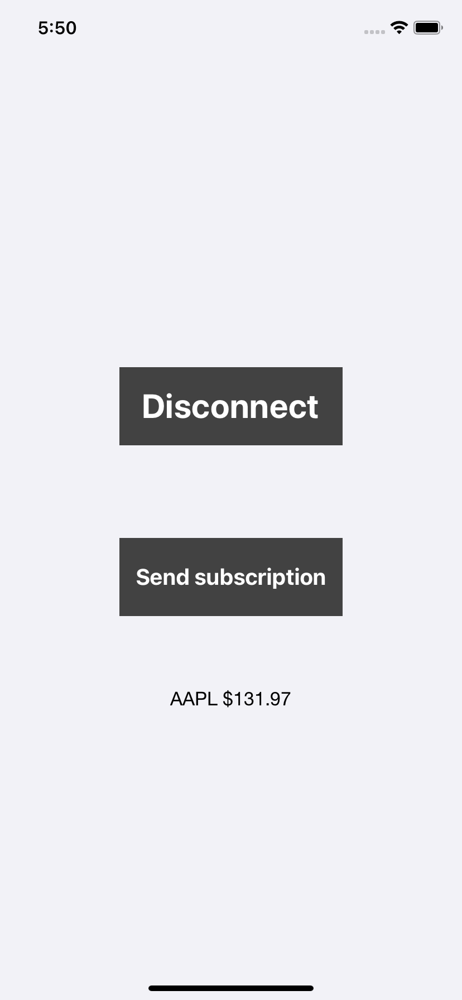

## API test
Tiny project for sending test **HTTP-requests** to Finnhub API, subscribing and reading data through **WebSockets** (Starscream lib used).
 

## WebSockets
Label text updates on WebSocket update using **KVO**
